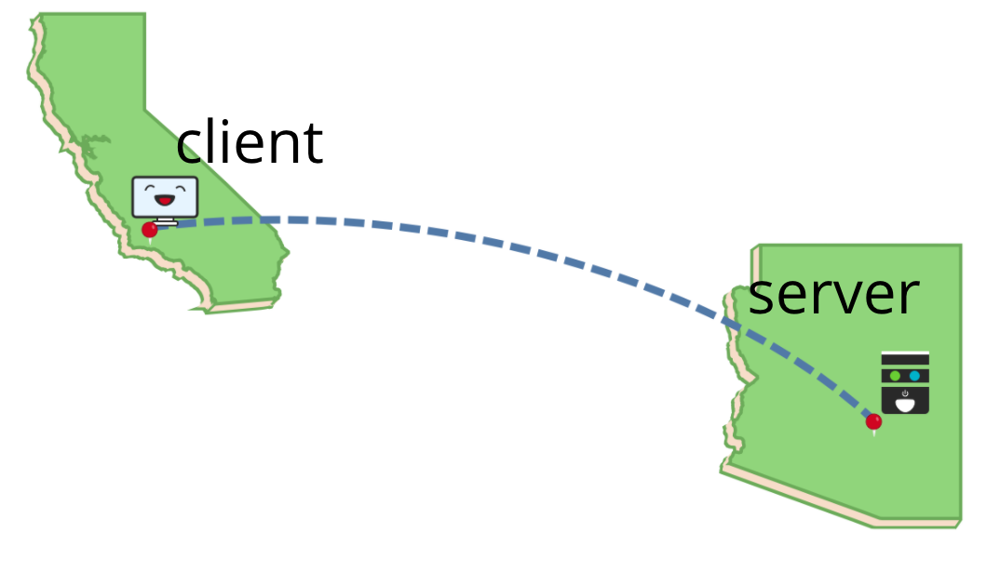
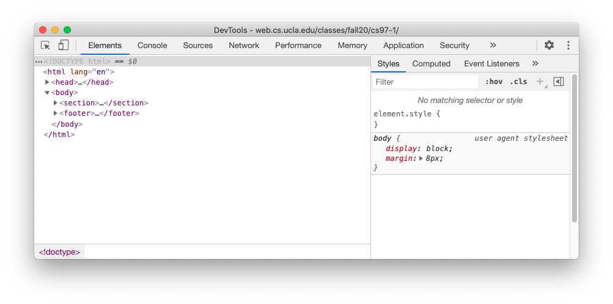
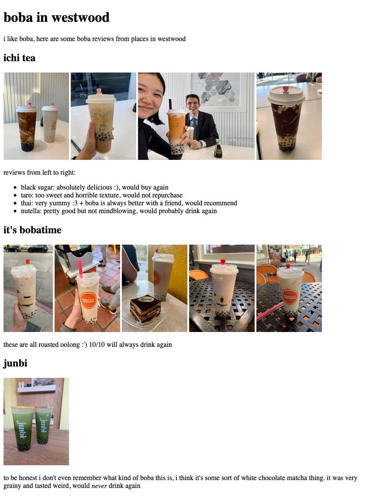
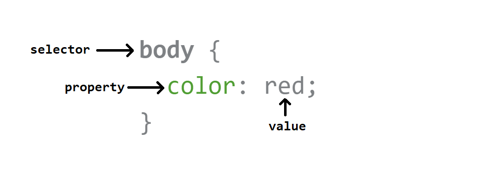
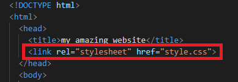

# Hackschool Session 1: Introduction to HTML/CSS

**Date**: October 14, 2020

**Location**: Zoom

**Teachers**: Jamie Liu, Miles Wu

## Resources

- [Slides](https://docs.google.com/presentation/d/1eZhKeaflOOm6lEzTwdoP3kiP7VwdmZspdIt77I1Yqiw/edit?usp=sharing)
- [ACM Membership Attendance Portal](http://members.uclaacm.com/login)

## What we'll be learning today

- [Basic Dev Environment Setup](#basic-dev-environment-setup)
- [What is Web Development?](#what-is-web-development)
- [HTML](#html)
- [CSS](#css)

---

## Basic Dev Environment Setup

### Browser With a Debugger

We highly recommend [Google Chrome](https://www.google.com/chrome).

### Text Editor

Use whatever text editor you are most comfortable with, there is no "best" text
editor. In this workshop we'll be using [VS Code](https://code.visualstudio.com/),
but here are some alternatives:

- Get [Sublime Text 3](https://www.sublimetext.com/).
- Get [Atom](https://atom.io/).

---

## What is Web Development?

When you go to a URL in your browser and press "Enter", your computer makes a
request to another computer (called a server) for the webpage you're trying
to load. The server will send your computer some files that represent the
webpage, and your browser uses those files to render the webpage.



You can actually see the files being transferred if you use the Network tab
in your Chrome developer tools!

Developers build websites by writing the code that describes what should be
shown in the browser. The foundational languages for web development are HTML,
CSS, and JavaScript. Today, we'll be learning some introductory HTML and CSS.

---

## HTML

### What is HTML?

HTML stands for Hyper Text Markup Language.

**Hypertext** is just text that can have links (hyperlinks) to other text.
Though HTML can support things like images and tables now, the "hypertext" in
the name comes from what HTML was historically used for.

**Markup** comes from the idea of editors "marking up" paper manuscripts with
corrections as well as typographic instructions: make this heading larger, make
that word bold, etc. Similarly, we use "tags" in HTML to mark different parts
of our documents. These tags are used to describe the **structure** and
**content** of a page.

### What does HTML look like?

Let's look at the [Fall 2020 CS 97 course website](http://web.cs.ucla.edu/classes/fall20/cs97-1/) for an example.

In Google Chrome, right click and press "Inspect" to open the developer tools. Make sure the "Elements" tab is selected, and you should see something like this:



A few key elements that we see:

- `<!DOCTYPE html>`: tells our web browser (Google Chrome) that this is an HTML
  document
- `<html>`: shows where the HTML content is
- `<head>`: contains information that isn't displayed in the webpage (like the title)
- `<body>`: surrounds visible content on the webpage

What other tags can we find?

- `<h1>`, `<p>`, `<ul>`, ...

### Let's experiment with HTML!

1. Make a new folder and open it in your preferred text editor.
2. In the folder, create a new file named `index.html`
3. Add the following code into this file, and Save.
```html
<!DOCTYPE html>
<html>
   <head>
   </head>
   <body>
   </body>
</html>
```

#### Whitespace and Indentation

Try typing some lines of text in the `<body>` section. For example:

```html
<body>
	hello
	
	hi
    hey
</body>
```

Whitespace and indentation do not matter in HTML. However, indenting your code
neatly makes it more readable and clean!

#### Tag: Line Break

The `<br />` tag specifies a line break.

```html
hello <br />
hi
```
- this tag is self-closing, which means it does not need a corresponding closing tag!

#### Comments

Comments in HTML are surrounded by `<!--` and `-->`, and do not appear on the rendered view of the webpage.

```html
<!-- a comment in HTML -->
<!-- comments
can also
be multiline -->
```

#### Tag: `<title>`

The `<title>` tag is used to define the title for the page. This is the title
that labels the tab in your browser and is also used for search results.

Since this tag doesn't define any content that should appear in the webpage
itself, it belongs in the `<head>` section.

```html
<title>my amazing website</title>
```

#### Tag: Headers

There are 6 header tags from `<h1>` to `<h6>`. The `<h1>` tag is the
largest/most important, while the `<h6>` tag is the smallest/least important.

Header tags are used for section headers or other important information.

```html
<h1>i am Big</h1>
<h6>i am smol</h6>
```

#### Tag: `<p>`

The `<p>` or paragraph tag indicates paragraphs.

```html
<p>this is a paragraph of text</p>
<p>this is another paragraph</p>
```

- You can use the `<strong>` and `<em>` tags to indicate that the enclosed text
  is "strong" or should be "emphasized".
  - You might be wondering: Doesn't this change the style? I thought HTML isn't
    supposed to specify style! For more on that, read [this Stack Overflow
    answer](https://stackoverflow.com/a/271776).

#### Tag: `<button>`

This tag creates a button element.

```html
<button>i am a button</button>
```

#### Tag: `<a>`

The `<a>` tag is used for hyperlinks, and the destination of the link is
specified with an `href` **attribute**.

```html
<a href="https://github.com">this is a link to GitHub</a>
```
- attributes define other characteristics or properties of an HTML element
  - they consist of a name/value pair: `name="value"`

#### Tag: ``

You can use the `` tag to insert an image, specified by the `src` attribute. This source can be either an online image URL or a path to a local image.

```html


```

- the `` tag is self-closing
- the `` tag also has other attributes you can specify
  - `alt`: alternate text to describe an image
  - `height`: set the height of the image

#### Tag: Lists

In HTML, there are ordered lists `<ol>` and unordered lists `<ul>`. Each list item gets an `<li>` tag.

```html
my favorite trees:
<ol>
	<li>japanese maple</li>
	<li>cherry blossom</li>
	<li>redwood</li>
</ol>

some cool people (in no particular order):
<ul>
	<li>Galen</li>
	<li>Shirly</li>
	<li>Asha</li>
</ul>
```

#### Tag: Inputs

The `<input>` tag supports [many different types of inputs](https://developer.mozilla.org/en-US/docs/Web/HTML/Element/input).

```html
<form>
  <input type="text" placeholder="write stuff here" />
  <input type="range" />
  <input type="submit" />
</form>
```

- `<input>` tags are self-closing
- the `<form>` tag groups `<input>` elements that can be submitted together

#### Tag: `<div>` and `<span>`

These tags are somewhat special, in that they don't describe the content of the
page (compared to `<h1>` which labels a header, `<a>` which makes a link, etc.).
Instead, they are used to group chunks of HTML. This might not seem particularly
useful at the moment, but it will be important when we learn CSS.

```html
<div>
  <h1>hello</h1>
  <p>html is <span>fun</span></p>
</div>
```

### HTML Activity

Make a basic website about something! Feel free to look at [this list of HTML
elements](https://developer.mozilla.org/en-US/docs/Web/HTML/Element) and
experiment with various HTML tags and attributes.

Ideas for what to make:

- a personal website with information about you
- a website for your pet
- an info page about something! (a hobby, your favorite animal, etc.)

Example - a boba review page:
 

---

## CSS

### What is CSS?

CSS stands for Cascading Style Sheets.

**Style sheets** are collections of style rules that specify the "look and feel" of a webpage's content. We apply these style rules to HTML tags.

**Cascading** is a bit more complicated but essentially just refers to how if multiple stylesheets are being used for one piece of HTML, the chosen rule is determined in a "cascading" fashion. Meaning more specific rules take priority over more general rules.

### Let's talk about CSS Style Rules

Every CSS style rule consists of three main components: a **selector**, some **properties**, and **values** associated with each property.

Below is an example of what a CSS rule might look like:



Let's break down what exactly each of these three components are:

#### Selectors

The CSS selector determines which HTML elements on the page are affected by the rule being defined. In other words, the styles specified in the rule will be applied to your "selected" element(s).

In the example shown in the image above, the selector is `body`. This means the style in this rule will be applied to the corresponding `<body>` tag in the HTML file.

#### Properties

Every element has a set of characteristics called properties that can be manipulated and styled. Including properties in your CSS rule means you want to specify how those properties look for your selected element(s).

In the example, we have the property `color` which refers to the color of any text within a given element.

Briefly, here are some basic properties in CSS. You can find a full list [here](https://www.w3schools.com/cssref/), **don't bother memorizing**:

- Text Related: `color`, `letter-spacing`, `text-align`, `text-decoration`, `text-transform`
- Element Related: `width`, `height`, `border`, `background-color`
- Spacing Related: `padding`, `margin`
- Font Related: `font-size`, `font-weight`, `font-family`

#### Values

Each property field in your CSS rule must be supplied a value. These values specify exactly how you want to style that particular property.

In the example, we have a value of `red` supplied to the property `color`. This will make all text in the `<body>` tag red.

### Linking your CSS to your HTML file

1. In the same folder as your `index.html` file, create a new file called `style.css`
1. Add a style rule to the file (like the example before)
1. In the `<head>` tag of your HTML file add the following line of code:

```html
<link rel="stylesheet" href="style.css" />
```

Your HTML file should look something like this afterwards:



Once you've linked the HTML and CSS files you should be able to see the appearance of your website change if there are any existing style rules in your CSS file.

For example, if your CSS file contained

```css
body : {
	color: red;
}
```

then all the text in your webpage should turn red.

### CSS Classes and IDs

Now that you know about CSS rules, you might be asking yourself "What if I want to apply style rules to very specific elements? Maybe only some of the `<h1>` tags or only a specific `<p>` tag.

This is where the concept of CSS Classes and IDs comes into play.

#### CSS Classes

CSS Classes are used to define a group of elements that you want to apply the same styles to. There is no limit to how many elements or what kind of elements can be a member of the class.

In HTML, we specify an element is part of a class by adding the `class` attribute to it. For example:

```html
<div class="myclass"></div>
```

To define the style rule for classes, we use a special selector of the following form:

```css
.myclass {
	color: blue;
}
```

`myclass` can be replaced with any identifier you want, as long as the HTML element's class matches the same name. We now have a style rule that can be applied to any group of elements you choose. All you have to do is add the corresponding class attribute.

#### CSS IDs

An ID is used to uniquely identify a single HTML tag. Any given ID can only be applied to a single HTML element and any HTML element can only have a single ID.

In HTML, we specify an element's ID by adding the `id` attribute to it. For example:

```html
<div id="myid"></div>
```

To define the style rule for an id, we use the following special selector:

```css
#myid {
	color: green;
}
```

Just like with classes, `myid` can be replaced with any identifier you want. However, unlike classes, your ID must be unique for each element. With this, we can now apply styles to one specific element on the page.

### CSS Activity

Now make some style rules that you can apply to the website you made from the HTML activity! Feel free to use [this list of basic CSS properties](http://web.simmons.edu/~grabiner/comm244/weekthree/css-basic-properties.html) and experiment with different values/properties.
